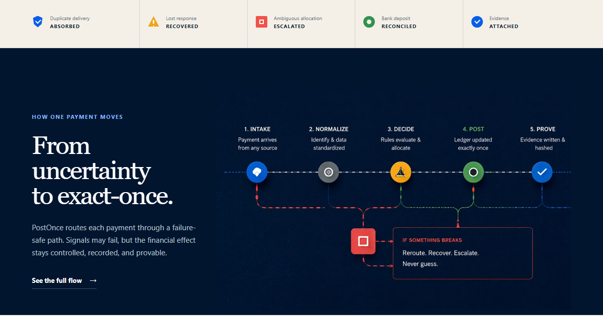
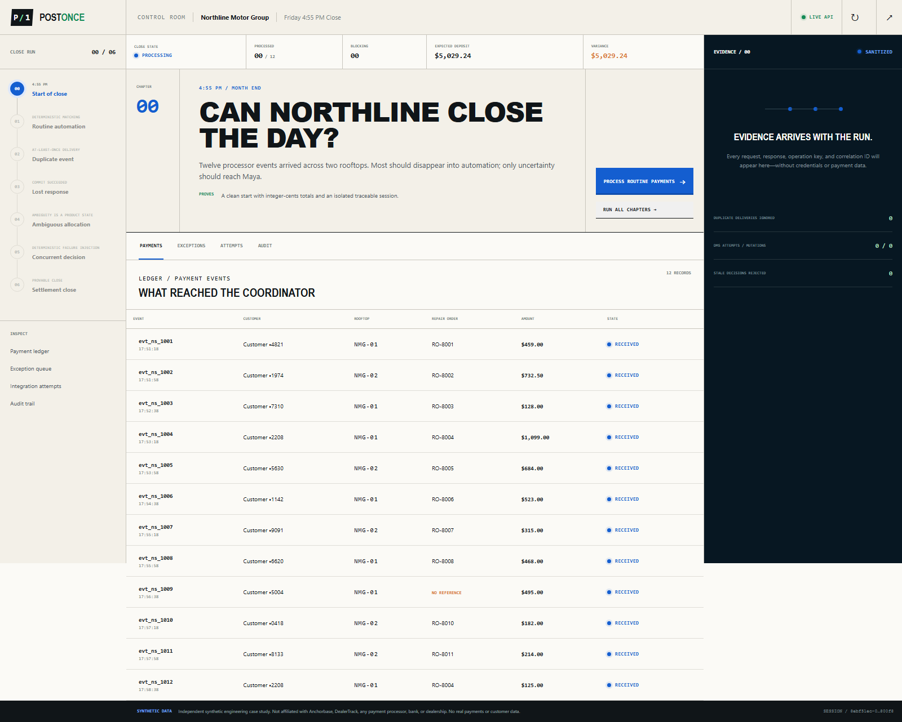
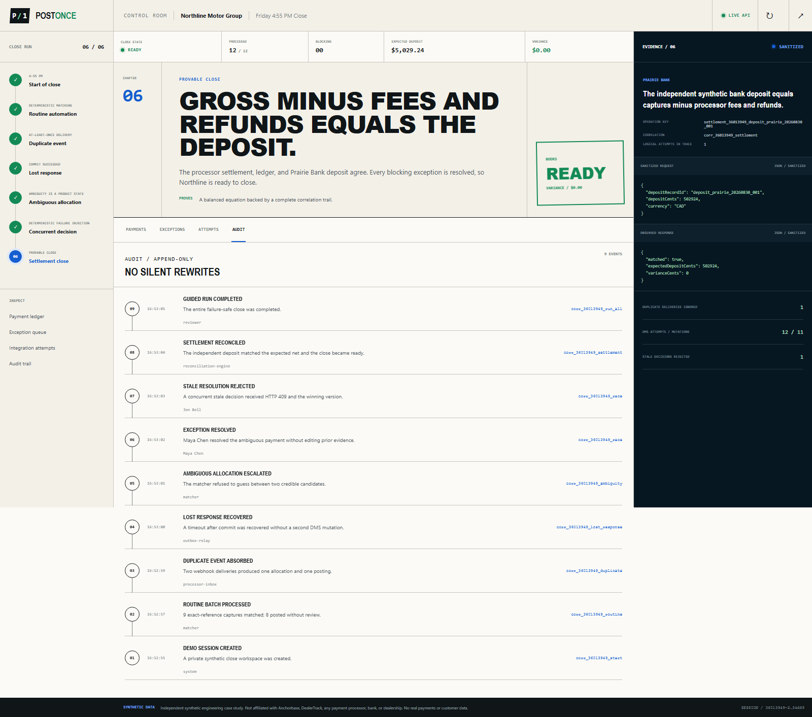
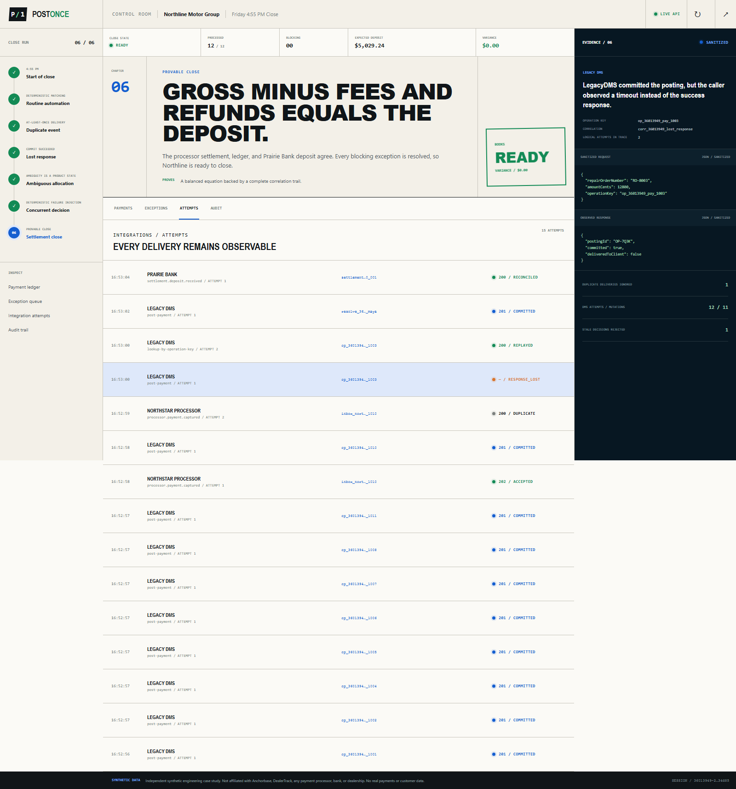
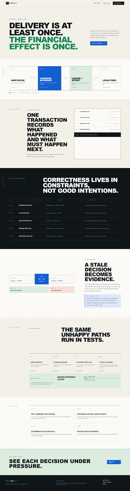

# PostOnce

**Every payment posts once. Every exception stays explainable.**

PostOnce is an independent engineering case study for failure-safe payment posting and reconciliation. It follows one fictional dealership close across a system of record, a payment processor, and a bank settlement feed—then makes duplicate delivery, lost responses, ambiguous matching, and concurrent decisions visible instead of hiding them.

PostOnce is not a payment processor and does not move money. It is not affiliated with, commissioned by, or connected to Anchorbase, DealerTrack, or any real dealership, bank, processor, or DMS. Every person, business, endpoint, identifier, and transaction is synthetic. No cardholder data is used.



## Review the build

- Live case study: [postonce.swoop.video](https://postonce.swoop.video)
- Guided close run: [postonce.swoop.video/demo](https://postonce.swoop.video/demo)
- Architecture and evidence: [postonce.swoop.video/architecture](https://postonce.swoop.video/architecture)

The public demo creates an isolated browser session. Actions from one visitor never mutate another visitor's run. If the API is unavailable, the interface explicitly identifies its read-only local preview; it never presents browser-only state as server-persisted evidence.

## The 90-second close

The fictional controller for Northline Motor Group starts a Friday close with two rooftops and twelve processor events:

1. **Routine automation** matches exact references and posts them without human work.
2. **Duplicate delivery** sends one processor event twice; the inbox records both attempts but financial state changes once.
3. **Lost response** lets LegacyDMS commit a posting, drops the response, and safely recovers it with the same operation key.
4. **Ambiguous allocation** refuses to guess between two plausible repair orders and opens a reviewable exception.
5. **Concurrent decision** submits two resolutions at the same version; one wins and one receives a conflict with the winning result.
6. **Settlement close** derives gross captures from payment events, fees from an independent processor record, and the deposit from an independent bank record before the close can become ready.
7. **Evidence trace** ties the full run together with stable correlation, operation, and event identifiers.

The interface explains each result in plain language and exposes the sanitized request, response, audit, and invariant evidence behind it.

## Verified interface evidence

| Isolated close run | Reconciled and ready |
| --- | --- |
|  |  |

| Lost-response trace | Architecture and invariants |
| --- | --- |
|  |  |

The full evidence set is generated through `npm run screenshots -- <base-url>`. Landing-only desktop, mobile, and social previews are generated with `npm run screenshots:landing -- <base-url>`; both capture paths fail on browser errors or horizontal clipping.

## What this proves

| Concern | Implementation | Visible proof |
| --- | --- | --- |
| At-least-once input | Durable inbox and unique provider event IDs | Two deliveries, one mutation |
| Safe outbound retry | Transactional outbox and stable destination operation key | One DMS posting, two attempts |
| Concurrent review | Versioned exception update | One accepted decision, one `409` conflict |
| Financial correctness | Integer cents, explicit currency, allocation constraints | Reconciliation equation and invariant counters |
| Explainability | Append-only events and sanitized integration evidence | Correlated timeline and evidence drawer |
| Public isolation | Per-reviewer demo sessions | Reset and replay without cross-visitor mutation |

The project intentionally does not claim exactly-once network delivery. Networks retry and responses disappear; PostOnce makes the underlying domain mutation idempotent.

## Repository map

```text
apps/web             React, Vite, and TypeScript reviewer experience
apps/api             NestJS REST API and integration simulators
packages/contracts   Shared runtime schemas and TypeScript contracts
database             Explicit PostgreSQL migrations
docs                 Product, architecture, failure, and review notes
infra                Containers, reverse proxy, and deployment scripts
```

## Run locally

Requirements: Node.js 22+, npm, and optionally PostgreSQL 17. Without `DATABASE_URL`, the API uses process-local storage intended only for development and automated tests.

```bash
npm install
npm run dev:api
npm run dev:web
```

The API defaults to `http://localhost:3001`; the Vite client defaults to `http://localhost:5173` and proxies `/api` during development.

To run with PostgreSQL, copy the documented environment example after the infrastructure package is generated, start the database container, and apply the migrations before the API starts.

## Verify

```bash
npm run check
```

The check runs strict TypeScript validation, domain/API tests, UI tests, and production builds. `npm run verify` adds the Chromium journey and 360/390px clipping checks. The synthetic benchmark measures indexed repair-order lookup; duplicate delivery and concurrent resolution are proved separately in the behavioral test suites.

## Read further

- [Product specification](docs/PRODUCT_SPEC.md)
- [Architecture](docs/ARCHITECTURE.md)
- [Failure matrix](docs/FAILURE_MATRIX.md)
- [API contract](docs/API_CONTRACT.md)
- [Guided review script](docs/DEMO_SCRIPT.md)
- [Architecture decisions](docs/DECISIONS.md)
- [Security and data boundaries](docs/SECURITY.md)
- [Test strategy](docs/TEST_STRATEGY.md)
- [Domain glossary](docs/DOMAIN_GLOSSARY.md)

## License

The source is available under the [MIT License](LICENSE).
