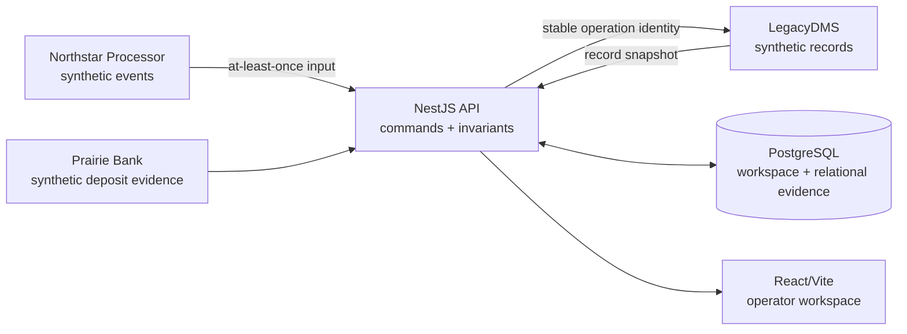

# Architecture

## System boundary

PostOnce is the coordination and evidence layer between three fictional external systems:

- Northstar Processor reports customer payments and processor payout data;
- LegacyDMS owns repair orders, parts tickets, deals, and the accepted posting result;
- Prairie Bank reports observed deposits and supporting notices.

PostOnce does not authorize cards, hold funds, replace the DMS, or claim a bank deposit merely because a posting request succeeded. The adapters are deterministic simulators inside this synthetic product boundary.



The product exposes the same business concepts through Close, Exceptions, Payments, Deposits, Activity, and Integrations. Technical evidence is attached to the payment or payout it explains rather than organized as a separate simulation workflow.

## State model

PostOnce deliberately has two timelines.

### Operational close

Each location owns an `OperationalClose` for one business date. Its readiness derives from:

- the number of in-scope payments;
- the number with a verified dealership-system effect;
- the number of open blocking operational exceptions.

A location can move from `BLOCKED` to `READY` only when verified postings equal in-scope payments and blockers equal zero. `CLOSED` adds an immutable attestation containing the operator, time, date, counts, and version. Current-day payout status is displayed in the close projection but does not participate in that readiness rule.

### Payout reconciliation

A `ProcessorPayout` tracks processor components, the observed bank deposit, preserved source records, append-only adjustments, and variance. Its lifecycle includes `PAYOUT_PENDING`, `VARIANCE`, and `RECONCILED`. A payout is reconciled only at zero variance.

This timeline may lag the operational day. A pending current-day payout or prior-day variance never changes an otherwise valid location close.

## Command path

The implemented write surface has three commands:

1. resolve an exception;
2. close a location;
3. record a supported settlement adjustment.

Every command follows the same boundary:

1. validate the JSON payload with the shared Zod contract;
2. bind the request to an isolated workspace and correlation ID;
3. enforce the session mutation window;
4. lock or version-check the persisted workspace;
5. enforce currency, amount, relationship, state, and evidence invariants;
6. append the accepted domain/evidence records;
7. persist the new snapshot and normalized projections in one transaction;
8. return the complete current workspace state.

The client never assumes a financial write succeeded from a click alone. It renders the state returned by the service.

## Exception resolution

An exception contains a monotonically increasing version and a bounded candidate set. A command identifies the version the operator saw, a stable idempotency key, and the chosen target.

The engine has distinct mutation paths for:

- payment-to-record allocation;
- refund-to-original-payment linking;
- the remaining allocation of a split tender.

It rejects targets outside the offered candidates, cross-location or cross-department links, excessive allocations, invalid record types, and reuse of an operation key for a different payload. The accepted local mutation and posting intent share a transaction. The synthetic DMS result is then verified before the exception becomes resolved and the location close is recalculated.

## Inbox: repeat delivery without repeat money

Processor transport is treated as at least once. A unique `(session_id, provider, external_event_id)` identity represents the logical input. A repeated delivery can add attempt evidence and increase its delivery count, but it returns the already-associated payment instead of creating another financial mutation.

`PAY-1006` is seeded as a recovered example. The operator can inspect it through Payments, Activity, or Integrations; there is no duplicate-event button.

```mermaid
sequenceDiagram
    participant P as Processor simulator
    participant A as PostOnce API
    participant DB as PostgreSQL
    P->>A: payment event (delivery 1)
    A->>DB: inbox identity + payment + audit
    DB-->>A: payment committed
    P->>A: same event (delivery 2)
    A->>DB: lookup unique inbox identity
    DB-->>A: existing payment
    A-->>P: replayed result; no second mutation
```

## Outbox and DMS verification

An accepted allocation or refund link and its outbound posting intent are persisted together. Every DMS attempt carries a stable operation key. If the destination commits but the response disappears, retrying with that same key finds the first effect rather than writing again.

`PAY-1017` is seeded with exactly that evidence: one response-lost observation, one safe replay, and one financial mutation. Its payment detail presents this as an evidence seam after the system has recovered.

PostOnce promises **at-least-once transport with idempotent domain mutation**, not exactly-once network delivery. The current bounded implementation records deterministic adapter evidence in the serialized workspace mutation. A production adapter would drain the persisted outbox after commit from a leased worker and resume expired claims after a process failure; that worker is not part of this repository's runtime claim.

## Concurrency and replay

The PostgreSQL repository locks the workspace aggregate before applying a mutation:

```sql
SELECT state
FROM demo_sessions
WHERE id = $1
FOR UPDATE;
```

Two callers may submit commands against the same visible version. The first accepted mutation advances state. The stale caller receives `409 VERSION_CONFLICT` with safe winning context and cannot create a second allocation, refund link, close, or adjustment. Rejected stale-attempt evidence is represented outside the accepted financial mutation.

Accepted commands also write append-only command receipts. An identical replay returns the original result. A changed payload under the same key receives `409 IDEMPOTENCY_KEY_REUSE`.

## Persistence

The repository stores a versioned workspace snapshot for deterministic reads and maintains relational projections for the financial and evidence records, including:

- payments, DMS records, allocations, and refund links;
- inbox receipts, posting outbox entries, DMS postings, and integration attempts;
- operational exceptions and audit events;
- per-location operational closes;
- processor payouts, settlement source records, and adjustments;
- synthetic integration connections and command receipts.

Database constraints backstop currency, allowed states, unique identities, close readiness, zero-variance reconciliation, and referential relationships. Append-only triggers protect refund links, settlement adjustments, and product command receipts from update or deletion.

Without `DATABASE_URL`, the API can use an in-memory repository for local development and fast tests. That mode has the same domain engine but is process-local and disposable. Production explicitly sets `DEMO_STORE=postgres`.

## Financial model

- Money uses integer minor units and an explicit currency.
- Allocations cannot exceed payment remainder or record balance.
- Accepted history is corrected with new evidence or compensating records, never silent edits.
- Payout arithmetic is `captured - refunds - fees + adjustments = adjusted expected`.
- Variance is `adjusted expected - observed deposit`; `0` is required for `RECONCILED`.
- No advisory explanation can write financial state.

## Synthetic workspace isolation

`POST /api/demo/sessions` creates a random workspace identifier and the deterministic fixture. The browser sends that UUID in `X-Demo-Session`; every repository read and mutation is scoped to it. Reset replaces only the caller's workspace.

The header is isolation for an anonymous synthetic environment, not authentication. A production multi-tenant product would bind the same boundary to an authenticated principal, authorize commands by role, enforce tenant policy at multiple layers, expire sessions, and define audit retention.

Anonymous workspace creation and mutation are bounded. The trusted host proxy overwrites `X-PostOnce-Ingress-Peer` from its actual peer, the loopback gateway strips caller-controlled forwarding identities, and the API hashes the validated address for admission limiting. Behind Cloudflare this groups by edge peer; it does not claim end-user identity.

## Evidence boundary

Evidence objects are allow-listed and size-bounded. They may include a fictional system, direction, operation, status, duration, stable event/operation key, correlation ID, and small sanitized bodies. They exclude authorization headers, cookies, credentials, environment values, database details, stack traces, and real financial or personal data.

## Shared-VPS deployment

The production topology has three Compose services:

- pinned PostgreSQL 17 with a dedicated persistent volume;
- the NestJS API on a private data network;
- a Caddy gateway that serves the compiled web client and proxies same-origin API traffic through loopback port `18044`.

GitHub Actions verifies the repository, builds `linux/amd64` API and gateway images, publishes them to GHCR, and writes their immutable digests into a checksummed operations artifact. The shared VPS only pulls those images; it never builds application code.

Deployment is constrained to `/opt/postonce`, Compose project `postonce`, the exact PostOnce containers/networks/volume, port `18044`, and `/etc/caddy/sites/postonce.caddy`. Preflight validates ownership, Caddy's complete configuration, sibling AudioFetcher health, free space, available memory, recent OOM pressure, and the absence of server-side builds. Cleanup and retention target PostOnce resources only; no global Docker prune is used.

A successful release retains the active release plus its immediate predecessor and only their referenced PostOnce image digests. Backups are capped by age and count. A failed first install removes only newly created PostOnce state. Rollback restores a retained application release after a backup, but migrations are not reversed and must remain backward compatible.

The exact boundary, thresholds, operator command, public checks, and rollback command live in [the production operations guide](../infra/README.md).
