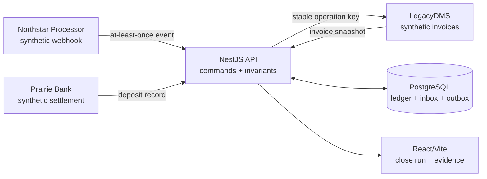
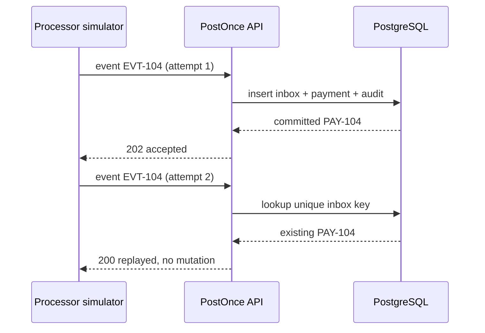

# Architecture

## System boundary

PostOnce demonstrates the coordination layer between three fictional systems. `LegacyDMS` owns repair-order invoices, `Northstar Processor` reports customer payments and settlement fees, and `Prairie Bank` reports the eventual deposit. PostOnce does not authorize a card, hold funds, or replace any of those systems.



The simulators are inside the demo boundary and deterministic. They exercise the same request, response, retry, and failure contracts an external adapter would use without implying access to a proprietary API.

## Command path

Every state-changing action follows the same shape:

1. validate the command at the HTTP boundary;
2. bind it to an isolated demo session and correlation ID;
3. begin a database transaction;
4. lock or version-check the relevant aggregate;
5. enforce domain invariants using integer cents;
6. append the domain event and any outbox work in the same transaction;
7. commit;
8. return a read model that explains what changed and what did not.

No real network call occurs. For deterministic public replay, the synthetic destination adapter and its attempt evidence execute inside the session transaction. Allocation and outbound intent still commit atomically, but this bounded implementation does not claim process-crash recovery between a database commit and an independent relay. A production extension would drain the same outbox contract after commit from a leased background worker.

## Inbox: repeated input without repeated state

Processor transport is treated as at least once. A unique key on `(session_id, provider, external_event_id)` identifies the logical message. The first delivery records the inbox item, payment, audit event, and any matching work atomically. A repeated delivery records observable attempt evidence but returns the already-created result.

The distinction is important: duplicate **delivery** is expected; duplicate **financial mutation** is not.



## Outbox: atomic intent and deterministic delivery evidence

Allocation and the intent to post it to LegacyDMS are persisted together. The guided action then invokes a pure, synthetic adapter and records the resulting attempts in the same serialized session mutation. This proves the operation identity, retry rules, and evidence model without pretending an external system was called.

For the lost-response chapter, LegacyDMS commits operation `OP-7Q3K` and the simulator discards the first HTTP response. The retry uses the original destination idempotency key. The destination returns the first result instead of posting again.

PostOnce therefore promises **at-least-once transport and idempotent mutation**, not exactly-once delivery.

The repository deliberately leaves a separate relay process outside the implemented scope. A production version would claim pending outbox rows with a lease after the transaction commits, persist destination receipts independently, and allow another worker to resume an expired claim. That architecture is described as a next step, not as evidence from this build.

## Concurrent exception decisions

An exception includes a monotonically increasing `version`. A decision command carries the version the reviewer saw. PostgreSQL locks the session aggregate before the engine compares that expected version with the persisted one. Two concurrent commands can be submitted, but the second waits, then observes the winning version and returns `409` rather than overwriting it:

```sql
SELECT state
FROM demo_sessions
WHERE id = $1
FOR UPDATE;
```

The accepted mutation, aggregate snapshot, normalized exception/allocation rows, and audit evidence are projected within that transaction. A stale version produces `409 VERSION_CONFLICT` with the winning decision and cannot allocate the payment a second time. The public guided action deterministically preserves both outcomes as explanatory evidence. In the raw concurrent endpoint test, the rejected transaction rolls back and returns the winner to the caller; persisting rejected-command telemetry outside that transaction would be a production observability extension.

## Financial model

- Money is stored as integer minor units with a three-letter currency.
- Allocation totals cannot exceed a payment's remaining amount or an invoice's remaining balance.
- Posted history is append-only. Corrections use compensating or reversing events.
- A settlement uses the explicit equation `gross - fees - refunds = expected deposit`.
- A close cannot become `READY` while a blocking exception or variance remains.
- Advisory explanations never write to the ledger.

## Public demo isolation

`POST /api/demo/sessions` creates a random session identifier and deterministic scenario rows. The browser sends that identifier in `X-Demo-Session`. Every repository query includes the session boundary. Reset replaces only that run.

The header is a convenience for a synthetic public demo, not an authentication design. A production product would bind the same tenant boundary to an authenticated principal, authorize commands by role, and enforce isolation through application policy plus database-level controls.

Anonymous session admission is bounded at the trusted proxy boundary. The public host overwrites `X-PostOnce-Ingress-Peer` from its actual network peer, the loopback-only gateway strips public client-IP headers, and the API validates and hashes the resulting address before applying the creation window. It does not trust caller-supplied Cloudflare or forwarding headers. Behind Cloudflare this deliberately limits by edge peer rather than claiming authenticated end-user identity.

## Read model and evidence

The API composes a reviewer snapshot from the persisted domain state. The client does not infer financial outcomes. Evidence objects are deliberately sanitized and bounded; they include method, fictional destination, status, duration, operation key, correlation ID, and small request/response bodies but never secrets or card data.

## Deployment topology

Production uses three containers on private compose networks:

- PostgreSQL 17 with a persistent volume;
- the NestJS API, which applies or verifies migrations before serving;
- a small Caddy gateway serving the compiled web client and proxying same-origin API requests through one loopback-bound origin port.

The simulator adapters and deterministic relay live inside the API process for this bounded demo; there is no idle background worker container. The public browser calls same-origin `/api`, so the API and UI share a single TLS origin. Health checks gate deployment. The deployment script preserves the prior image and database backup long enough to roll back a failed release.

## Performance evidence

The benchmark is deliberately small and reproducible. It compares indexed repair-order lookup with a sequential scan over 50,000 deterministic synthetic invoices and reports average lookup time. Duplicate delivery and concurrent resolution are covered separately by domain, HTTP, and PostgreSQL tests. The benchmark is not a production capacity claim; it demonstrates the algorithmic reason for the selected index.
