# Product screenshot tour

[Live demo](https://postonce.swoop.video) · [Reviewer guide](REVIEWER_GUIDE.md) · [README](../README.md)

These are actual browser captures of the implemented product, not design mockups. All people, payments, and connected systems are fictional. Desktop captures use a 1536 × 1024 viewport; mobile captures use 390 × 844. Most desktop images include the full page; long payment ledgers, search, the confirmation dialog, and mobile captures show the viewport. Click any image to inspect it at full resolution.

Captured September 5, 2026. The business date and clock inside the demo are deliberately fixed. The sequence begins in a fresh workspace, then records real demo decisions before capturing their results. Local capture uses the same application code with disposable in-memory storage; the deployed demo uses PostgreSQL. These images demonstrate UI behavior, not production integration certification.

## Main screens

### 1. Daily close

Toyota and Subaru are ready. Ford has three blocking exceptions. Pending payouts are tracked separately.


### 2. Exceptions queue

Ford's open work, with the reason, amount, customer, age, and next action for each item.


### 3. Payment ledger

Customer and record context alongside posting and settlement status. This viewport shows the beginning of the 62-payment ledger.


### 4. Deposit ledger

Expected and observed deposits, including pending, matched, and variance states.


### 5. Activity

The history after completing the three exceptions, closing Ford, and recording the supported settlement adjustment. Human decisions and system events retain their actors.


### 6. Integrations

The three simulators, expanded recent attempts, identity guards, and the matching-policy explanation.


## Decision screens

### 7. Ambiguous payment match

Compare two repair orders. The exact amount and timing support the suggested candidate, but the operator must confirm.


### 8. Refund-to-original-payment link

Identify the purchase behind an existing refund. This records the relationship; it does not issue another refund.

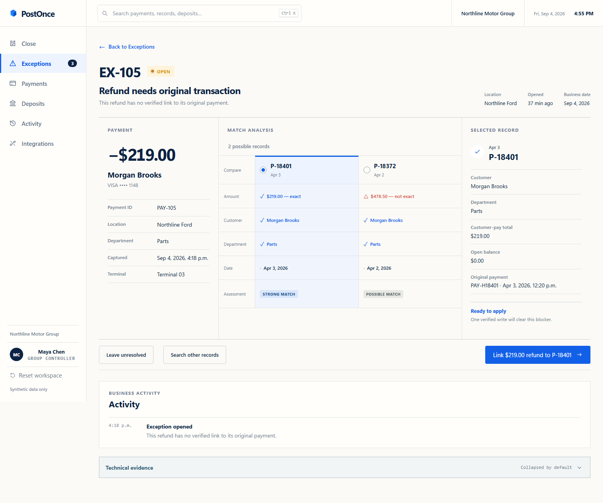

### 9. Split tender

The existing $1,550 and incoming $2,450 payments together cover one $4,000 repair order. They remain separate transactions.

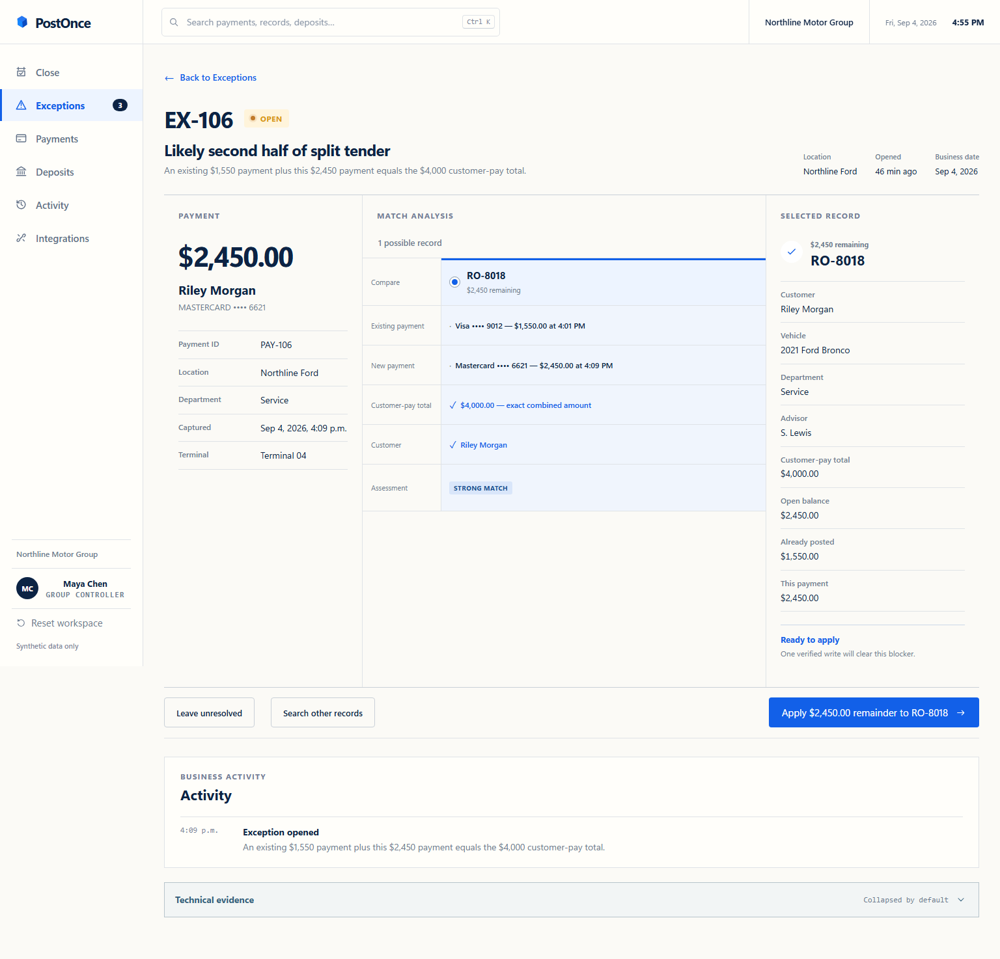

## Payment detail and evidence

### 10. Routine payment

The normal received → matched → posted → verified history, plus business details.

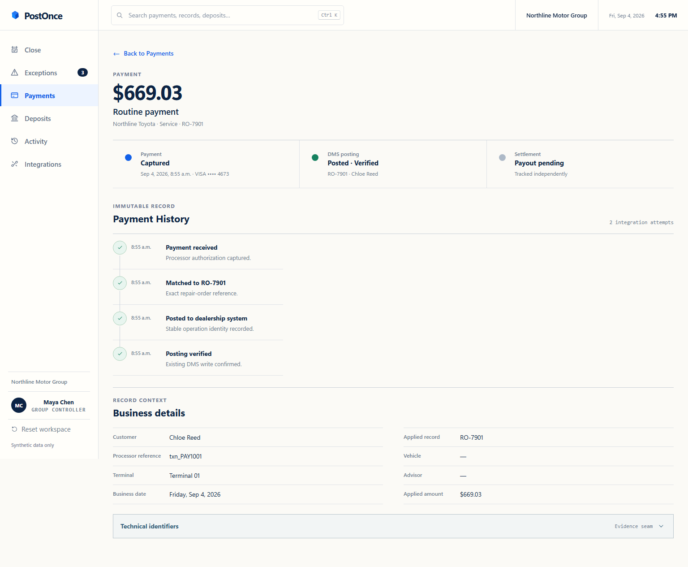

### 11. Lost-response recovery

Expanded evidence shows the simulated destination committed, its response was lost, and the repeated operation found the existing effect.


### 12. Duplicate-delivery payment

The payment record and expanded technical identifiers for the duplicate-delivery example. Its recovery event is also recorded in Activity; repeat delivery did not create a second payment.

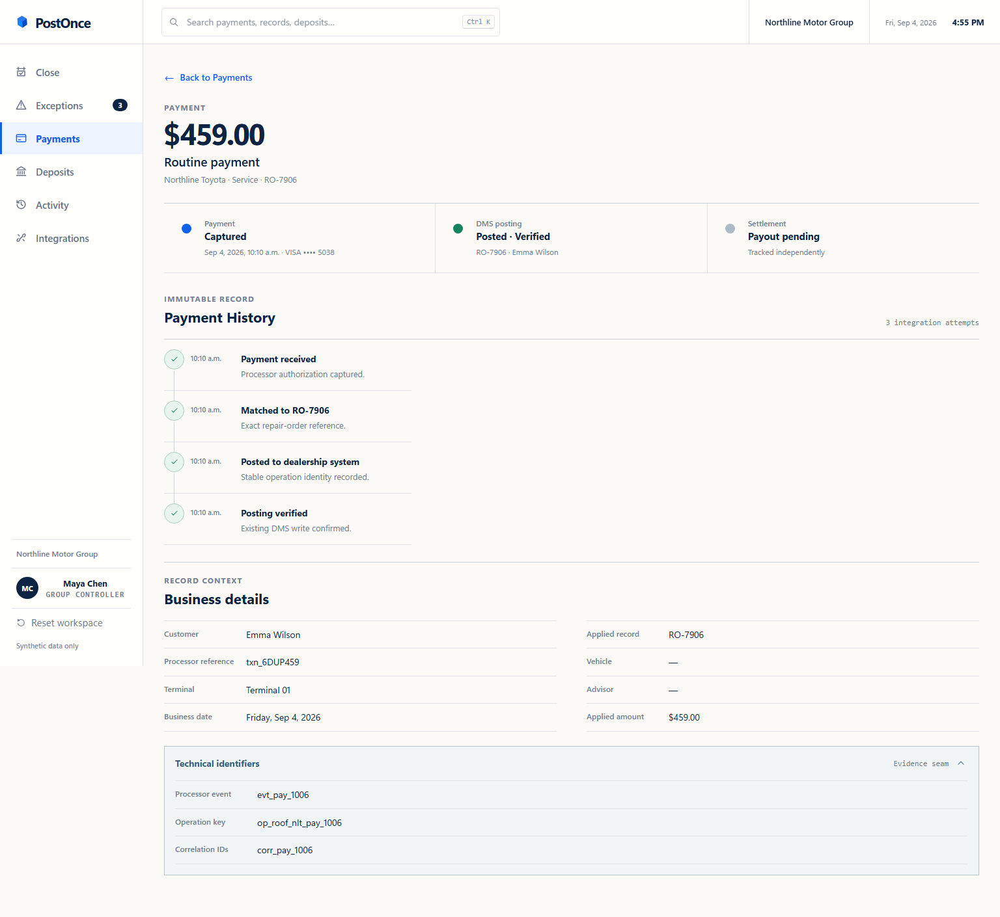

## Settlement workpapers

### 13. Unexplained variance

The expected deposit is $25 above the bank observation. The network-assessment notice supports a separate adjustment.


### 14. Already-matched deposit

Toyota's prior-day expected and observed amounts agree; no controller adjustment is required.

The fixture does not provide this payout's component breakdown, so those fields say “Not available” rather than falsely reporting zero.

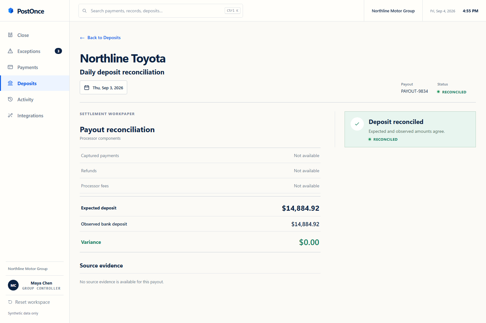

### 15. Pending payout

No bank receipt is claimed before an observation exists.

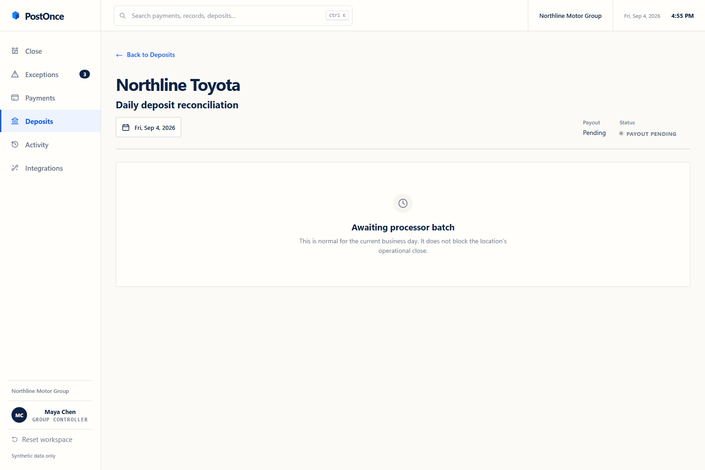

## Search and completed states

### 16. Global search

Searching Daniel Harper returns grouped payments and dealership records without changing business state.

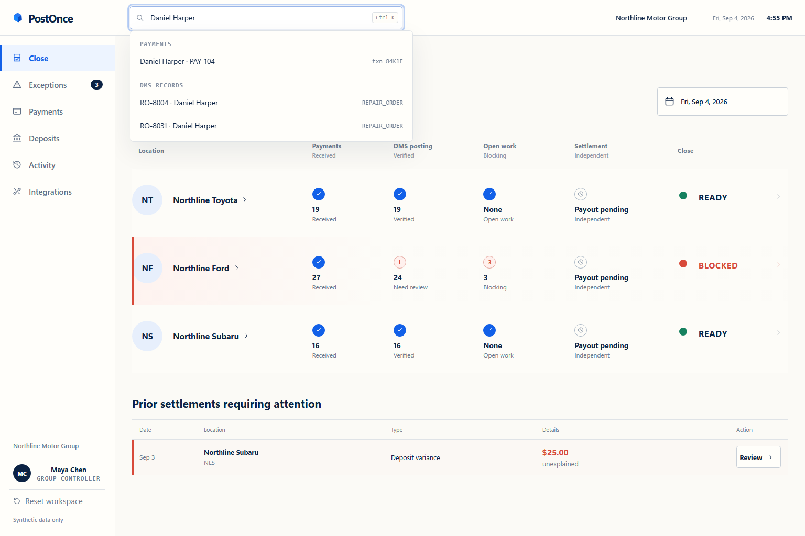

### 17. Verified exception resolution

The accepted decision identifies the operator and verifies the dealership-system write.

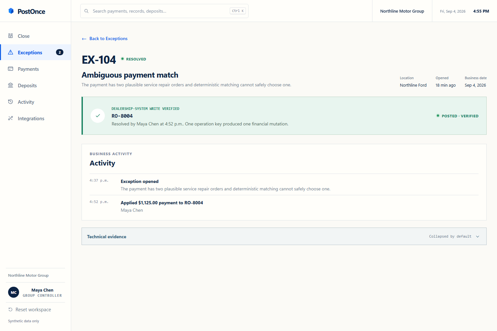

### 18. Close confirmation

The operator reviews the payment count, verified postings, and blockers before signing off.

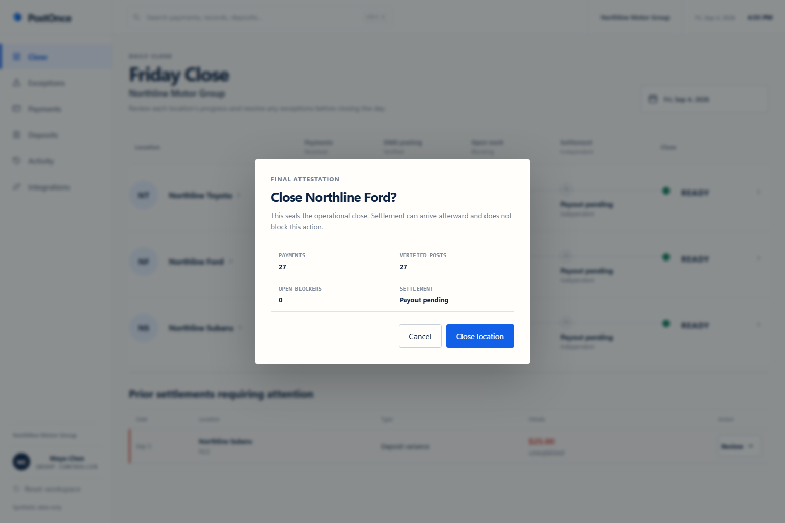

### 19. Closed location

Ford is closed by Maya Chen while its payout remains pending.

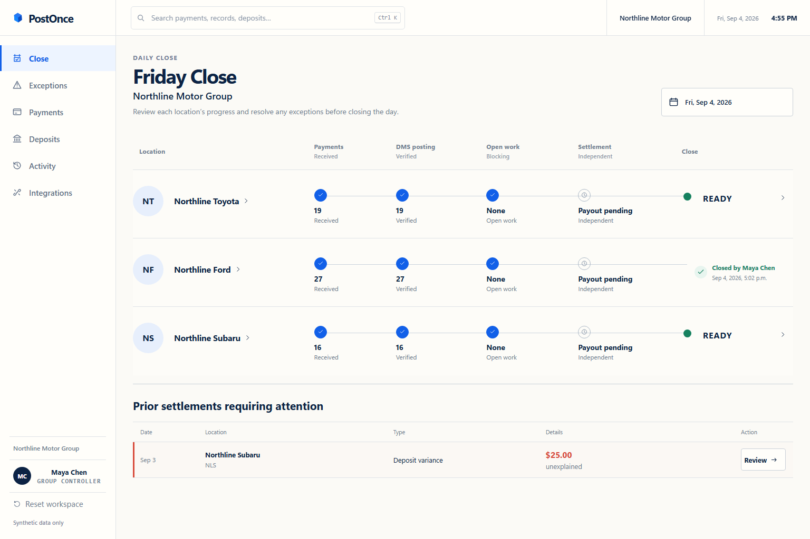

### 20. Supported adjustment recorded

The original expected amount remains visible. The adjusted expectation equals the bank observation and the variance is zero.

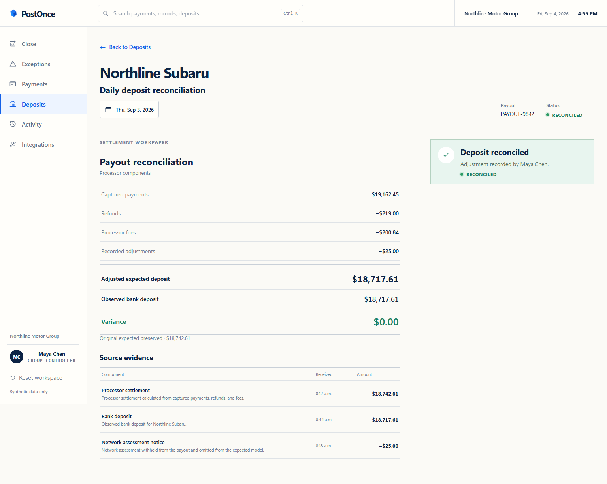

## Architecture and responsive layouts

### 21. Architecture screen

The public technical explanation of delivery semantics, system boundaries, and evidence.

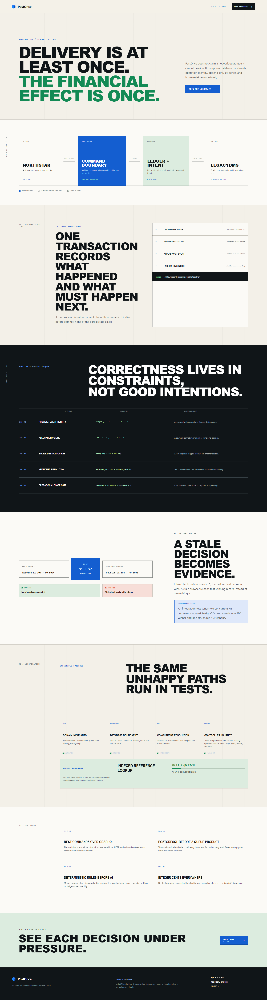

### 22. Mobile close


### 23. Mobile payment ledger

Rows become labeled records at phone widths rather than a clipped desktop table. This view is scrolled past the filters to the first records.


### 24. Mobile decision screen

Scrolled to the candidate comparison, with the normal fixed mobile navigation still visible.


## Reproduce

Run the local API and web app using the [README](../README.md#run-locally), then:

```bash
npx playwright install chromium
npm run screenshots:review
```

The capture script starts a new anonymous workspace and executes only synthetic actions in that workspace. It checks page loads, expected completion states, and browser errors. An optional base URL can be passed as `npm run screenshots:review -- https://your-demo-host`.

This directory is the current reviewer gallery. Older images under `screenshots/product` support the existing test/capture workflow; images under `screenshots/web` are historical artifacts and are not the current product tour.
